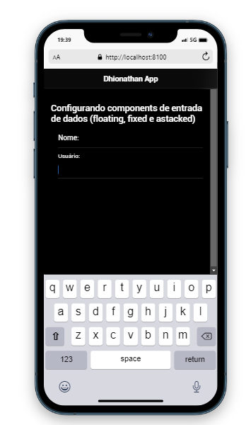
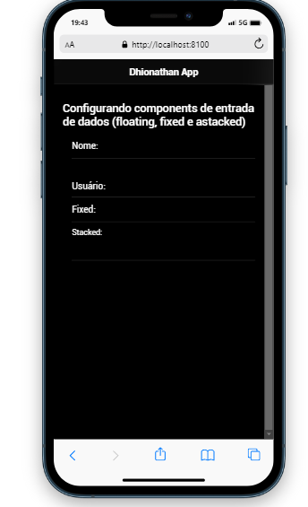
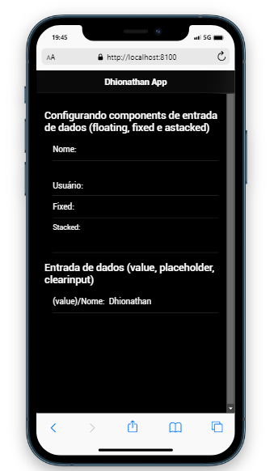
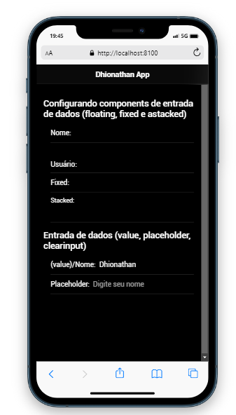
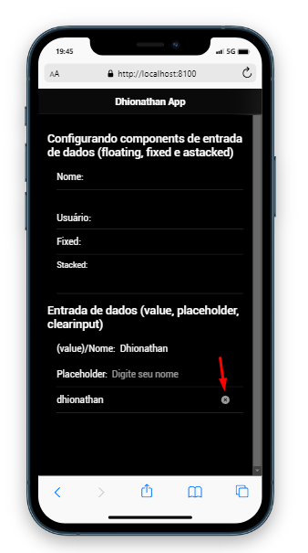
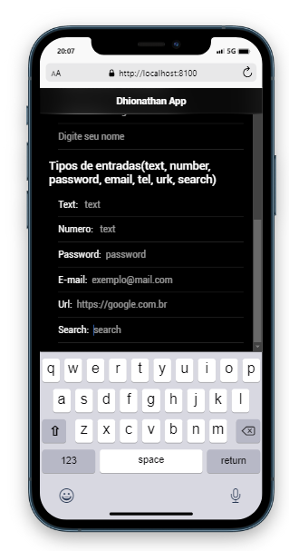

* Aula sobre Botões:
 

 
* Aula sobre Card e Lista
- Card comum:

- Card com cabeçalho:

Cartões com listagem de itens:

- Listas:

- Lista de avatars:

- Lista com slide para exibir opções ao arrastar o item

- Components de entrada de dados:
* Input normal  

- Input label postion floating:

- Input label fixed/ stacked:

- Input value preenchido:

- Input placeholder:

Input com clearInput:

Tipos de input:
